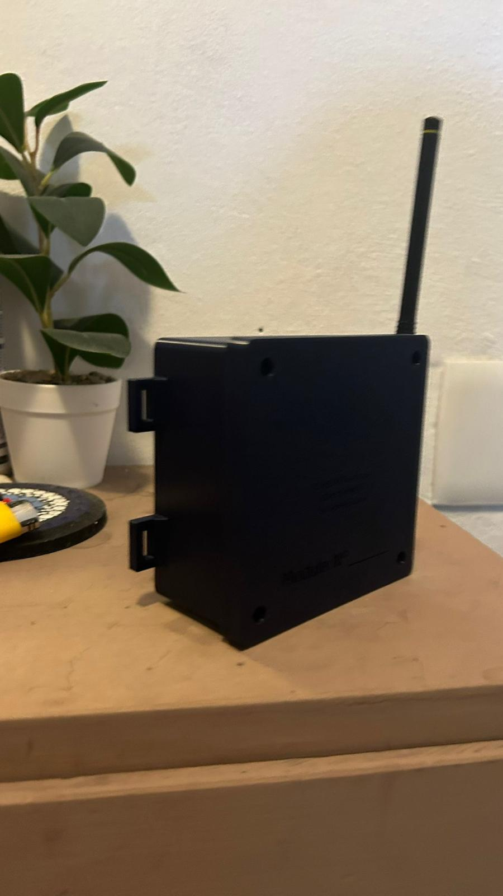
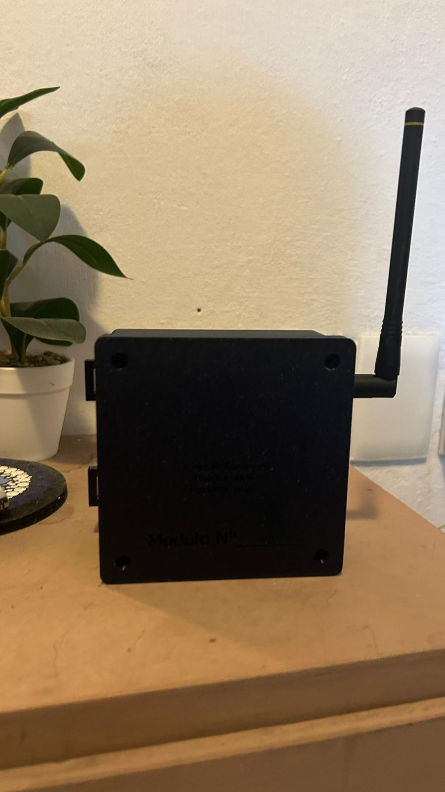
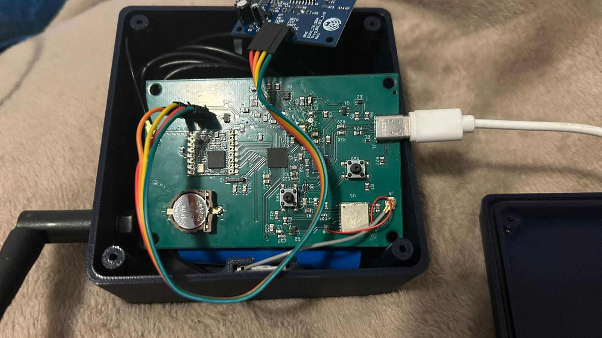
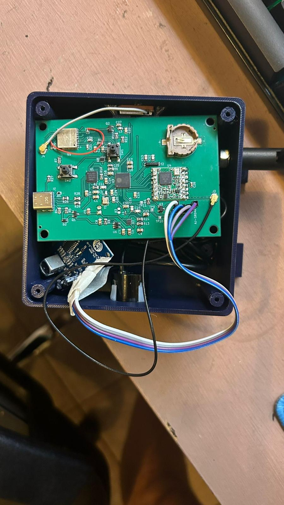
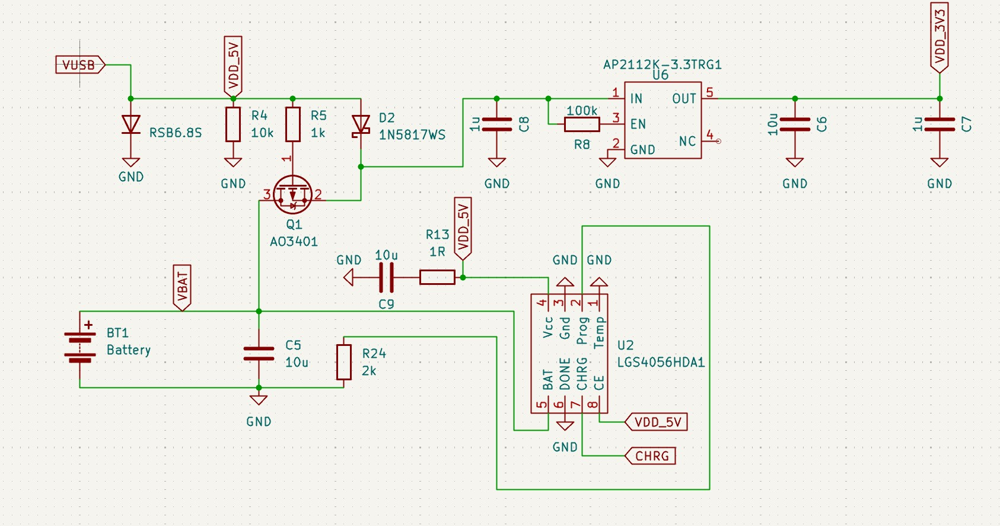
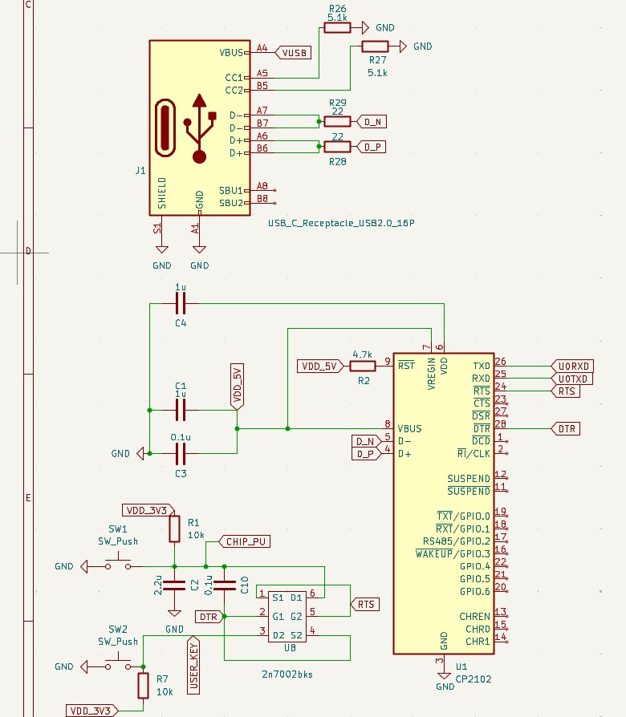

# IoT System for Water Management in Rice Paddies

Embedded IoT system for LoRa + GPS telemetry, integrating custom hardware, embedded firmware, iterative PCB design, and a Node-RED backend.

## Final Prototype (V3)

The following images show selected views of the final hardware prototype (V3).

### Enclosure

  
  

### Custom PCB

  

  

### Auxiliary Modules
For example, Power management and USB to UART modules.

  

  

<h2>Firmware Flow Diagram</h2>

  

## System Overview

End-to-end IoT prototype for wireless telemetry using LoRa communication and GPS data acquisition, covering proof-of-concept validation, custom hardware development, embedded firmware, iterative PCB design, and a complete Node-RED data processing pipeline.

---

## Repository Structure

- `Codigo_lilygo/`  
  Proof-of-concept implementation using a LilyGO T3 v1.6.1 development board. Used for early validation of LoRa communication and end-to-end data flow through an initial Node-RED pipeline before custom PCB and GPS integration.

- `Firmware/`  
  Main embedded firmware for the custom PCB. Handles GPS acquisition, LoRa communication, and system logic.

- `Node Red/`  
  Node-RED flows for telemetry ingestion, processing, and visualization.

- `Envolvente/`  
  Mechanical enclosure design for system housing and protection.

- `V1.0/`  
  First PCB iteration used to validate the custom LoRa hardware.

- `V2.0/`  
  PCB redesign incorporating GPS integration and correcting initial hardware issues.

- `V3.0/`  
  Final PCB revision with optimized layout and complete system integration.

- `.gitignore`  
  Git ignore rules for build artifacts and temporary files.

- `README.md`  
  Project documentation.

---

## Development Flow

1. Proof-of-concept on a LilyGO T3 development board.
2. Validation of LoRa communication and the initial telemetry pipeline using Node-RED.
3. Design and validation of the first custom PCB (V1.0).
4. PCB redesign with GPS integration and hardware improvements (V2.0).
5. Final optimized hardware revision with complete system integration (V3.0).
6. Integration with the Node-RED backend and end-to-end system validation.

---

## Project Scope

The project covers the complete development cycle of an embedded IoT system, including:

- Embedded firmware development (C/C++)
- Custom electronic circuit design
- Schematic capture and PCB design (KiCad)
- PCB assembly and soldering
- LoRa wireless communication
- GPS integration
- MQTT-based telemetry
- Node-RED backend development
- Mechanical enclosure design
